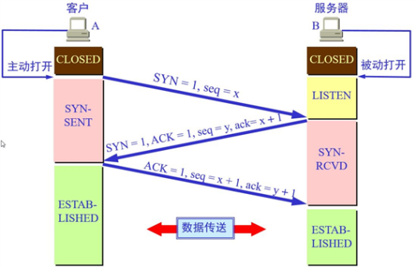
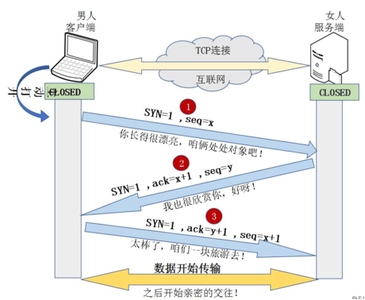

# TCP 报文格式(标准长度为20字节)

**TCP 数据包每次能够传输的最大长度 = MTU(1500B) - IP头(20B) - TCP头(20B) = 1460 Bytes。**

.png)

- 源端口号、目的端口号：标识了发送方与接收方的地址，IP 地址和端口号合称为套接字。

- 序列号(32位)、确认号(32位)：序列号与确认号可以理解成两个通信进程在收发数据的时候互相应答的信息(比如说：A进程从序列号1000开始给B进程发送数据，发送五个数据。那么在B收到数据回复的时候，这里A的确认序列号应该是从1006，如果不是1006，比如说是1003，那就意味着1004、1005数据包B没有收到，于是A启动重发机制。这也就保证了数据的可靠性，也是 TCP 的特点之一)。序列号是进程发送消息的号码，而确认号是期望目的进程返回的号码，二者进行比对就可以验证数据包是否到达。

- TCP 报头长度(4位)：可以理解成四个比特位表示长度，四个比特位表示的值乘以四就是该 TCP 头部的长度。由于报头长度最短为20字节，也就是说这里的四位 TCP 报头长度默认为 0101。并且 TCP 报头长度不可超过 15*4=60 个字节。

- 标志位(共6个，即 URG、ACK、PSH、RST、SYN、FIN 等)具体含义如下：
```text
URG：紧急指针是否有效。若其值为1则表示某一位需要被优先处理
ACK：确认号是否有效，一般置为1
PSH：提示接收端应用程序立即从 TCP 缓冲区把数据读走
RST：对方要求重新建立连接，复位
SYN：请求建立连接，并在其序列号的字段进行序列号的初始值设定。建立连接时其值设置为1
FIN：希望断开或释放一个连接
```

- 窗口大小(16位)：窗口大小标志着 TCP 缓冲区内部剩余空间的大小，起到一个流量控制的作用。如果窗口满了，那么这时是不允许数据接收的，后面到达的数据会被丢失。

- 校验和(16位)：由发送端填充，CRC 校验。接收端校验数据的时候如果校验不通过，那么认为数据有问题。此处的校验和不仅仅校验 TCP 首部，还校验数据部分。

- 紧急指针(16位)：标识哪部分的数据为紧急数据。

**说明：ACK、SYN、FIN 这些大写的单词表示标志位，其值要么是 1、要么是0；而 ack、seq 这些小写的单词表示序号。**

半连接、半打开、半关闭状态
```text
1、半连接状态：发生在 TCP 三次握手过程中，客户端向服务器发起连接，服务器也进行了回应，但是客户端却不进行第3次握手。
2、半打开状态：在 TCP 连接中，如果某一端关闭了连接或者是异常关闭，则该连接处于半打开状态。解决半打开问题：引入心跳机制就可以察觉半打开状态。
3、半关闭状态：当 TCP 链接中客户端向服务器发送 FIN 请求关闭，服务端回应 ACK 之后，并没有立即发送 FIN 给客户端，客户端就处于半关闭状态，此时客户端可以接收服务器发送的数据，但是客户端已经不能再向服务器发送数据。
```

# TCP 三次握手
所谓的三次握手实际就是 TCP 连接的建立，这个连接必须是一方主动打开，另一方被动打开的。以下为客户端主动发起连接的图解：



握手之前主动打开连接的客户端结束 CLOSED 阶段，被动打开的服务器端也结束 CLOSED 阶段，并进入 LISTEN 阶段，随后开始“三次握手”：

- 1、首先客户端向服务器端发送一段 TCP 报文，其中：
```text
标志位 SYN=1，表示请求建立新连接
序号 seq=X(X一般为1)，随后客户端进入 SYN-SENT 阶段
```

- 2、服务器端接收到来自客户端的 TCP 报文之后，结束 LISTEN 阶段，并返回一段 TCP 报文，其中：
```text
标志位 SYN=1、ACK=1，表示确认客户端的报文 seq 序号有效，服务器能正常接收客户端发送的数据，并同意创建新连接(即告诉客户端，服务器收到了它的数据)
序号 seq=y
确认号 ack=x+1，表示收到客户端的序号 seq 并将其值加1作为自己确认号 ack 的值。随后服务器端进入 SYN-RCVD 阶段
```

- 3、客户端接收到来自服务器端的确认收到数据的 TCP 报文之后，明确了从客户端到服务器的数据传输是正常的，结束 SYN-SENT 阶段，并返回最后一段 TCP 报文，其中：
```text
标志位 ACK=1，表示确认收到服务器端同意连接的信号(即告诉服务器，我知道你收到我发的数据了)
序号 seq=x+1，表示收到服务器端的确认号 ack，并将其值作为自己的序号值
确认号 ack=y+1，表示收到服务器端序号 seq，并将其值加1作为自己的确认号 ack 的值。随后客户端进入 ESTABLISHED 阶段
```

服务器收到来自客户端的确认收到服务器数据的 TCP 报文后，明确了从服务器到客户端的数据传输是正常的，结束 SYN-SENT 阶段，进入 ESTABLISHED 阶段。此后客户端和服务器端进行正常的数据传输。这就是“三次握手”的过程。

**注意：在客户端与服务器端传输的 TCP 报文中，双方的确认号 ack 和序号 seq 的值都是在彼此 ack 和 seq 值的基础上进行计算的，这样做保证了 TCP 报文传输的连贯性，一旦出现某一方发出的 TCP 报文丢失，便无法继续"握手"，以此确保了"三次握手"的顺利完成。**

“三次握手”的动态过程如下：


“三次握手”的通俗理解如下：



为什么需要三次握手？
```text
为了保证服务端能收接受到客户端的信息并能做出正确的应答而进行前两次(第一次和第二次)握手，为了保证客户端能够接收到服务端的信息并能做出正确的应答而进行后两次(第二次和第三次)握手。
```

在三次握手过程中，如果服务器一直收不到客户端的 ack 会发生什么？
```text
服务端会给每个待完成的半连接都设一个定时器，如果超过时间还没有收到客户端的 ack 消息，则重新发送一次 SYN-ACK 消息给客户端，直到重试超过一定次数时才会放弃。这个时候服务器需要分配内核资源维护半连接。
```

初始序列号 seq 为什么要随机初始化？
```text
这样做主要是为了保证网络安全，如果不是随机产生初始序列号，黑客将会以很容易的方式获取到你与其他主机之间通信的初始化序列号，并且伪造序列号进行攻击，这已经成为一种很常见的网络攻击手段。
```

# TCP 四次挥手
所谓的四次挥手实际就是 TCP 连接的释放(解除)，连接的释放必须是一方主动释放，另一方被动释放。以下为客户端主动发起释放连接的图解：


挥手之前主动释放连接的客户端结束 ESTABLISHED 阶段，随后开始“四次挥手”：

- 1、首先客户端想要释放连接，向服务器端发送一段 TCP 报文，其中：
```text
标记位 FIN=1，表示请求释放连接
序号 seq=U，随后客户端进入 FIN-WAIT-1 阶段(即半关闭阶段)，并且停止在客户端到服务器端方向上发送数据，但客户端仍然能接收从服务器端传输过来的数据
注意：这里停止发送的是正常连接时传输的数据(非确认报文)，而不是一切数据，所以客户端仍然能发送 ACK 确认报文
```

- 2、服务器端接收到来自客户端的 TCP 报文后，确认了客户端想要释放连接，随后服务器端结束 ESTABLISHED 阶段，进入 CLOSE-WAIT 阶段(即半关闭状态)并返回一段 TCP 报文，其中：
```text
标记位 ACK=1，表示接收到客户端发送的释放连接的请求
序号 Seq=V
确认号 ack=U+1，表示是在收到客户端报文的基础上，将其序号 seq 值加1作为本段报文确认号 ack 的值。随后服务器端开始准备释放服务器端到客户端方向上的连接
```

客户端收到来自服务器端的 TCP 报文后，确认了服务器收到了客户端发出的释放连接请求，随后客户端结束 FIN-WAIT-1 阶段，进入 FIN-WAIT-2 阶段。前"两次挥手"既让服务器端知道了客户端想要释放连接，也让客户端知道了服务器端了解了自己想要释放连接的请求，于是可以确认关闭客户端到服务器端方向上的连接了。

- 3、服务器端自从发出 ACK 确认报文后，经过 CLOSED-WAIT 阶段，做好了释放服务器端到客户端方向上的连接准备，再次向客户端发出一段 TCP 报文，其中：
```text
标记位 FIN=1，ACK=1，表示已经准备好释放连接了。注意：这里的 ACK 并不是确认收到服务器端报文的确认报文
序号 seq=W
确认号 ack=U+1，表示是在收到客户端报文的基础上，将其序号 seq 值加1作为本段报文确认号 ack 的值。随后服务器端结束 CLOSE-WAIT 阶段，进入 LAST-ACK 阶段，并且停止在服务器端到客户端的方向上发送数据，但是服务器端仍然能够接收从客户端传输过来的数据。
```

- 4、客户端收到来自服务器端的 TCP 报文后，确认了服务器端已做好释放连接的准备，结束 FIN-WAIT-2 阶段，进入 TIME-WAIT 阶段，并向服务器端发送一段报文，其中：
```text
标记位 ACK=1，表示接收到服务器准备好释放连接的信号
序号 seq=U+1，表示是在收到了服务器端报文的基础上，将其确认号 ack 值作为本段报文序号的值
确认号 ack=W+1，表示是在收到了服务器端报文的基础上，将其序号 seq 值作为本段报文确认号的值。随后客户端开始在 TIME-WAIT 阶段等待 2MSL(为什么要客户端要等待 2MSL，见后文)
```

服务器端收到来自客户端的 TCP 报文后结束 LAST-ACK 阶段，进入 CLOSED 阶段，由此正式确认关闭服务器端到客户端方向上的连接，客户端等待完 2MSL 之后，结束 TIME-WAIT 阶段，进入 CLOSED 阶段，由此完成“四次挥手”。

**注意：后“两次挥手”既让客户端知道了服务器端准备好释放连接了，也让服务器端知道了客户端了解了自己准备好释放连接了。于是可以确认关闭服务器端到客户端方向上的连接了，由此完成“四次挥手”。与“三次挥手”一样，在客户端与服务器端传输的 TCP 报文中，双方的确认号 ack 和序号 seq 的值，都是在彼此 ack 和 seq 值的基础上进行计算的，这样做保证了 TCP 报文传输的连贯性，一旦出现某一方发出的 TCP 报文丢失，便无法继续"挥手"，以此确保了"四次挥手"的顺利完成。**

“四次挥手”的通俗理解如下：


为什么建立连接时需要第三次通信 ？
```text
在第一次通信过程中，A向B发送信息之后，B收到信息后可以确认自己的收信能力和A的发信能力没有问题。
在第二次通信中，B向A发送信息之后，A可以确认自己的发信能力和B的收信能力没有问题，但是B不知道自己的发信能力到底如何，所以就需要第三次通信。
在第三次通信中，A向B发送信息之后，B就可以确认自己的发信能力没有问题。
小结：3次握手完成两个重要的功能，既要双方做好发送数据的准备工作(双方都知道彼此已准备好)，也要允许双方就初始序列号进行协商，这个序列号在握手过程中被发送和确认。
```

为什么建立连接是三次握手，而关闭连接却是四次挥手呢？
```text
在三次握手时，服务端可以把 ACK、SYN(ACK 起应答作用，SYN 起同步作用)放在一个报文里来发送。但是四次挥手时，服务端发送的 FIN、ACK 是分开发送的。原因在于：首先 FIN 信号是由于调用 close 所以才发送的，而 ACK 是由内核发送的，所以 ACK 报文和 FIN 报文在发送的时间上都是分开的，不一定能同时发送。但是三次握手的时候发送 SYN 是由内核直接完成的，所以这就可以达到一个同步发送的情况。
```

CLOSE_WAIT 状态有什么影响？
```text
如果服务器的代码没有调用 close，那么意味着并没有发送 FIN 结束报文段。那么也就是说，此连接的服务器长期保持在 CLOSE_WAIT 状态，这会有什么影响？服务器长期保持在 CLOSE_WAIT 状态，也就是说分配的文件描述符并没有关闭并归还。那么大量的 CLOSE_WAIT 存在的话，就会导致一种资源的泄漏，可能到最后就没有可分配的文件描述符了，那么就会使一些客户端无法连接，从而造成不可估量的影响。
```

socket 中的 close 是一次就关闭的吗？半关闭状态是怎么产生的？
```text
使用 close 中止一个连接，但它只是减少文件描述符的引用计数，并不直接关闭连接，只有当描述符的引用计数为0时才关闭连接。客户端的半关闭状态：收到服务器的 ACK 后，暂时关闭写端，但是读端并没有关闭，依然可以接受来自服务器的数据。
```

如果已经建立了连接，但是客户端突发故障了怎么办？
```text
TCP 设有一个保活计时器，显然，客户端如果出现故障，服务器不能一直等下去，白白浪费资源。服务器每收到一次客户端的请求后都会重新复位这个计时器，时间通常是设置为2小时，若两小时还没有收到客户端的任何数据，服务器就会发送一个探测报文段，以后每隔75分钟发送一次。若一连发送10个探测报文仍然没反应，服务器就认为客户端出了故障，接着就关闭连接。
```

为什么需要 TIME_WAIT 状态？
```text
保证可靠(可靠性是 TCP 最根本的特征)地终止 TCP 连接：处于 TIME_WAIT 状态的客户端会向服务端发送 ACK，如果此时 ACK 丢失，目的端会超时重传 FIN 报文段，目的端收到重传的报文段最少需要 2MSL，所以发送端会等待 2MSL 时间。
客户端在发送 ACK 后，再等待 2MSL 时间，可以使本次连接所产生的数据段从网络中消失，从而保证关闭连接后不会有还在网络中滞留的数据段去骚扰服务端。
```

2、为什么 TIME_WAIT 状态还需要等 2MSL 后才能返回到 CLOSED 状态？
```text
我们知道服务端收到 ACK，关闭连接。但是客户端无法知道 ACK 是否已经到达服务端，于是开始等待？等待什么呢？假如 ACK 没有到达服务端，服务端会为 FIN 这个消息超时重传 timeout retransmit，那如果客户端等待时间足够，又收到 FIN 消息，说明 ACK 没有到达服务端，于是再发送 ACK，直到在足够的时间内没有收到 FIN，说明 ACK 成功到达。这个等待时间至少是：服务端的 timeout + FIN 的传输时间，为了保证可靠，采用更加保守的等待时间 2MSL。客户端发出 ACK，等待 ACK 到达对方的超时时间 MSL(最大报文生存时间)，等待 FIN 的超时重传，也是 MSL，所以如果 2MSL 时间内没有收到 FIN，说明对方安全收到 ACK。
```

TIME_WAIT 会带来哪些问题？
```text
作为服务器，短时间内关闭了大量的 Client 连接，就会造成服务器上出现大量的 TIME_WAIT 连接，占据大量的 tuple，严重消耗着服务器的资源。
作为客户端，短时间内大量的短连接，会大量消耗 Client 机器的端口，毕竟端口只有 65535 个，端口被耗尽了，后续就无法再发起新的连接了。
```

# 参考文章
> https://blog.csdn.net/daaikuaichuan/article/details/83475809
> https://blog.csdn.net/qq_38950316/article/details/81087809
> https://blog.csdn.net/qzcsu/article/details/72861891
> https://blog.csdn.net/u010918487/article/details/87207531
> https://blog.51cto.com/jinlong/2065461
> https://www.cnblogs.com/AhuntSun-blog/p/12028636.html
> https://www.cnblogs.com/AhuntSun-blog/p/12037852.html
> https://www.pianshen.com/article/2872927776/
> https://zhuanlan.zhihu.com/p/199284611?utm_source=wechat_session
